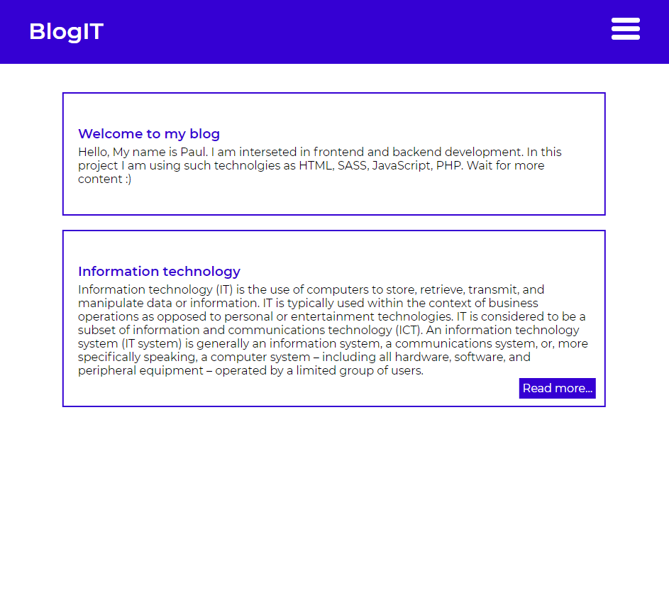
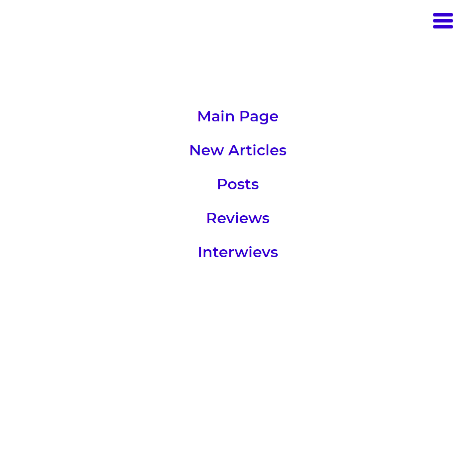
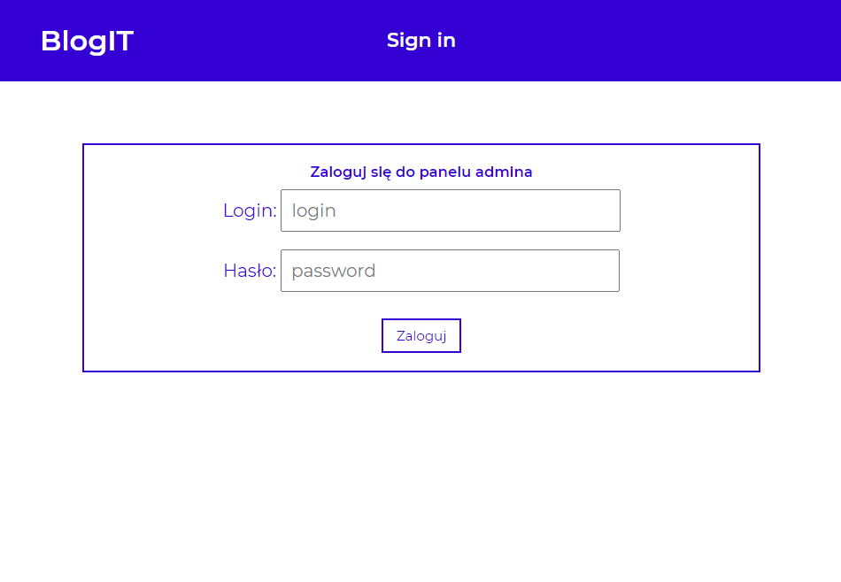
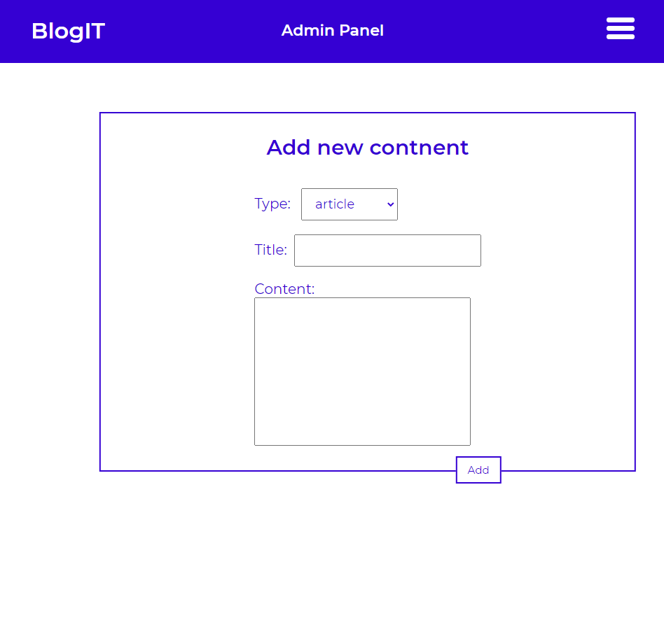

# Blog in PHP
This project is a small CMS (Content management system). It contains pages for users, also it has got a admin panel, if you are loged you can add content to this site. In this appliaction I'm using cookies, sessions and other basics comands from PHP. This app is connected with databse (MySql) on localhost. If you want to test it you should use XAMPP. I decided to write styles in preprocessor Sass, because this project has got many layouts.

This is the main page of project.

User can navigate throu this app using this hamburger.

The administrator must log in to add content.

Admin can add content by using this form.
